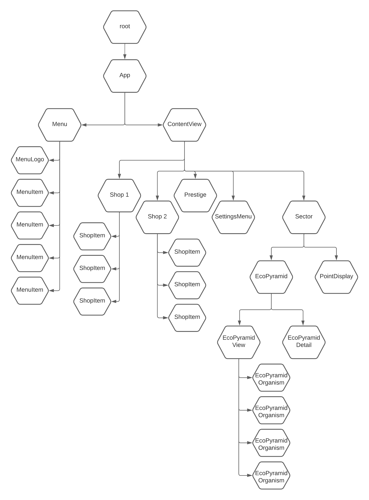
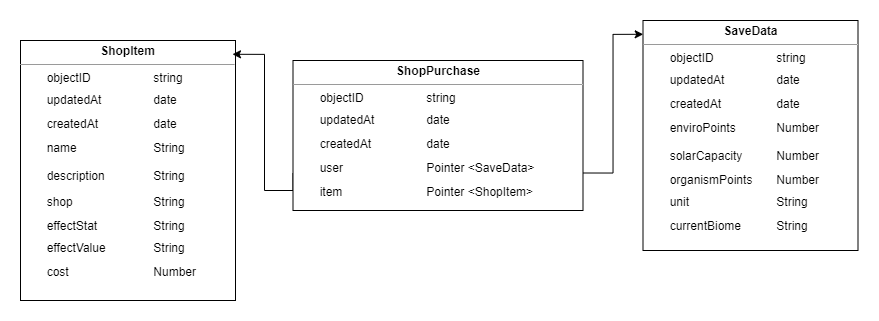

# eco-idle

An idle game about managing a burgeoning ecosystem.

Made with React, Hosted Parse, and Tailwind CSS.

## Development

Commands to run/build the app:

### `npm start`

Runs the app in the development mode.\
Open [http://localhost:3000](http://localhost:3000) to view it in your browser.

The page will reload when you make changes.\
You may also see any lint errors in the console.

### `npm run build`

Builds the app for production to the `build` folder.\
It correctly bundles React in production mode and optimizes the build for the best performance.

## Design

Component tree:

UML Diagram:

## User Stories
### Tanner Waltz
- User should be able to see their own account’s data and progress when they log in to the game
- User should be able to click organism icon and bring up menu giving description of the organism, along with buttons for interaction
- User should be able to buy organisms using enviro points they have earned
- User should be able to buy individual upgrades for their organisms using enviro points they have earned
- User should be able to buy upgrades from the shroom shop and enviro shop using the enviro points they have earned
- User should be able to see the upgrades they buy have the desired effect
- User should be able to earn enviro points from the organisms they have bought
- User should be able to see the total number of enviro points they have accumulated
- User should be able to save their game state to the server, being able to begin playing again later
- User should have the option to have the game automatically save at a pre-defined interval

You can test the user stories by creating an account and playing through the game yourself. You can also use a test account, test@test.test (password: test) to start with a large amount of money.

### Joshua Cepeda
- User will be able to download a packaged application from the repository and play our game offline, with a locally hosted backend Parse server.
- User will be able to access our game from a hosted website with a registered domain name.
- Developer will be able to initiate a GitHub action that automatically packages a commit's code as a downloadable, self-contained application.

## Known Bugs
- Sometimes the point counter will display as Object at login. When this happens, logout and back in.
- The progress bar animations do not always sync up with the actual point-earning intervals.
- Prestiging is not functional yet, but the game is still playable.
- The save options do not work properly.
